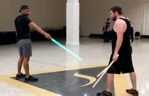

# CM-Q

  <iframe src="https://www.youtube.com/embed/-dfGeakzpCs" title="CM-Q demonstration" style="position:absolute;top:0;left:0;width:100%;height:100%;border:0;" allowfullscreen></iframe>

CM-Q interprets the exchange between Ahsoka Tano and Anakin Skywalker in *Star Wars: Ahsoka*, between 1:51 and 2:09 of the scene — the rhythm, pressure, and forward-driving momentum of that duel rather than a beat-for-beat copy of it.

Saberist A fights with a single saber. Saberist B dual-wields two blades, and every one of their cells is written per blade — `L-` for the left saber, `R-` for the right — so the two weapons are tracked independently throughout. It is the advanced half of the [CM-N](cm-n.md) pairing: CM-N is dual wielding against a single saber at beginner level, CM-Q is the same matchup once both Saberists are moving at pace.

CM-Q was notated by Knights G.C. Christopher and Tim Lynch.

## Notation

CM-Q runs twenty steps, written in two tables read in order.

!!! note "Wide tables"
    The tables below are wide. On a phone, turn the device landscape; either table can also be scrolled sideways.

**Part 1**

| Player | S1 | S2 | S3 | S4 | S5 | S6 | S7 | S8 | S9 | S10 |
|---|---|---|---|---|---|---|---|---|---|---|
| Saberist A | 12 | 1 | 9 | 5 | | St-B | Bl-3 | | 3P | |
| Saberist B | 12P | R-1P | L-9P | R-5P | S CW | L-3C+R-9C | L-12C | S CCW | R-3 | S CCW |

**Part 2**

| Player | S11 | S12 | S13 | S14 | S15 | S16 | S17 | S18 | S19 | S20 |
|---|---|---|---|---|---|---|---|---|---|---|
| Saberist A | 5P | St-B | Duck | 3PX | Grab | Bend Arm Back | | | | |
| Saberist B | L-5 | S CW | L-11+R-11 | L-3X | 12 | Locked | | | | |

Read down each column as usual.

- **`S CW` and `S CCW` are spins**, per the [Notation Legend](../notation/legend.md#body-and-movement-symbols) — clockwise (left shoulder toward right) and counter clockwise (right shoulder toward left). Saberist B spins three times in Part 1 (S5, S8, S10) and once more in Part 2 (S12), turning between blades while the sequence keeps moving.
- **Saberist B's cells are split by blade.** `L-` marks the left saber, `R-` the right. At S6, `L-3C+R-9C` is both blades completing at once, on different lines — left to the 3-o'clock target, right to the 9. At S13, `L-11+R-11` is both blades attacking the same 11-o'clock line together.
- **`C` reads as complete** — the same symbol as `©` elsewhere in the library, written here without the character. `L-3C+R-9C` and `L-12C` are both completes.
- **`Bl-3` is a blend to the 3-o'clock line**, per the `Bl-` modifier on the [Notation Legend](../notation/legend.md#notation-modifiers).
- **`X` locks, and Part 2 ends on one.** `3PX` at S14 for Saberist A and `L-3X` for Saberist B both lock the blade; Saberist B's final cell, `Locked`, confirms the sequence closes bound rather than resetting to guard.
- **S17–S20 are blank for both Saberists.** The sequence resolves at S16 — sixteen live steps, not twenty.

## Inspiration Video

This movement is built from a real filmed duel, not a general theme. Compare the notation to the source fight below.

[{ width="220" }](https://youtu.be/XdUm1bP8fV0?t=108 "Watch the Ahsoka vs. Anakin scene CM-Q is drawn from")

Select the thumbnail to watch the scene. CM-Q covers roughly 1:51 to 2:09 of the fight.

## Telegraph

**Saberist A (single saber) points the saber tip down at 45°. Saberist B (dual-wielding) draws both sabers.**

{ width="300" }

The telegraph is the silent signal that calls CM-Q before an exchange begins. See [LUMINA Games](../games/index.md) for how telegraphs are used in play.

## Purpose

CM-Q is designed to teach:

- reading a table where one Saberist's line is a single blade and the other's is two, tracked separately
- a dual wielder completing with both blades on different lines in the same beat
- a dual wielder attacking the same line with both blades at once
- closing a sequence into a hold rather than resetting to guard

## Training method

### Phase 1: Saberist A's line alone

Walk Saberist A's ten steps of Part 1, one at a time, against a stand-in partner or slowly with Saberist B. Confirm each numbered attack and parry lands on the agreed target before moving on.

### Phase 2: Saberist B's two blades

Isolate Saberist B's cells and rehearse each blade separately before combining them. At S6 and S13, where both blades act in the same beat, set which blade moves first (if either) and agree the exact lines before running them together.

### Phase 3: Full pace, to the lock

Once both Saberists are confident in their own line, run Part 1 and Part 2 together at low speed, then increase pace. Treat S16 as the end of the sequence — there's nothing written after it to rush toward.

## Teaching note

`Bend Arm Back` at S16 is written in the lesson's own shorthand rather than a standard Legend symbol — the demonstration video shows the beat, the way `Drama` and `9 BB` do for CM-P. Since CM-Q is a dual-wielding sequence, walk that beat from video first rather than guessing the arm position from the name alone.

Continue to **[CM-R](cm-r.md)**, or return to the [Extended Library](extended-library.md).
